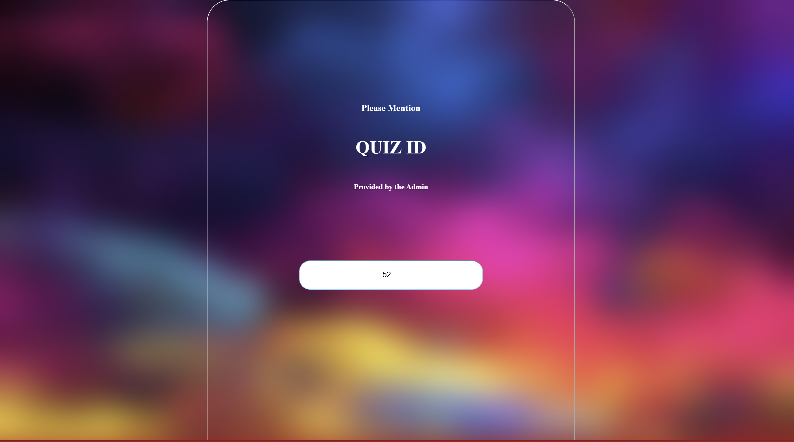
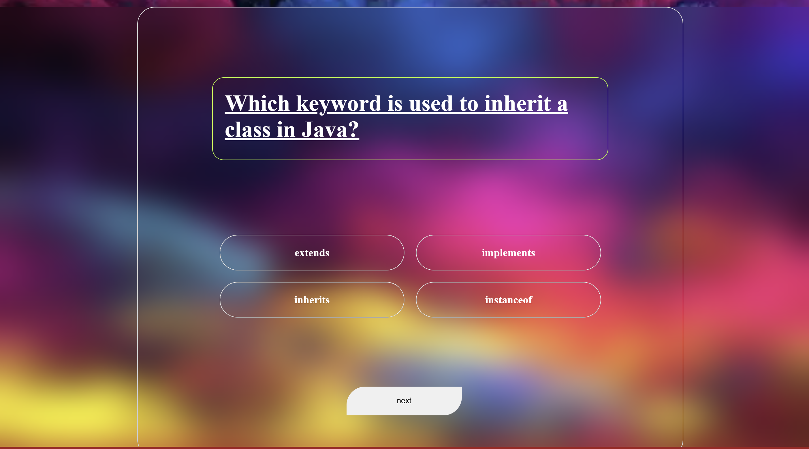
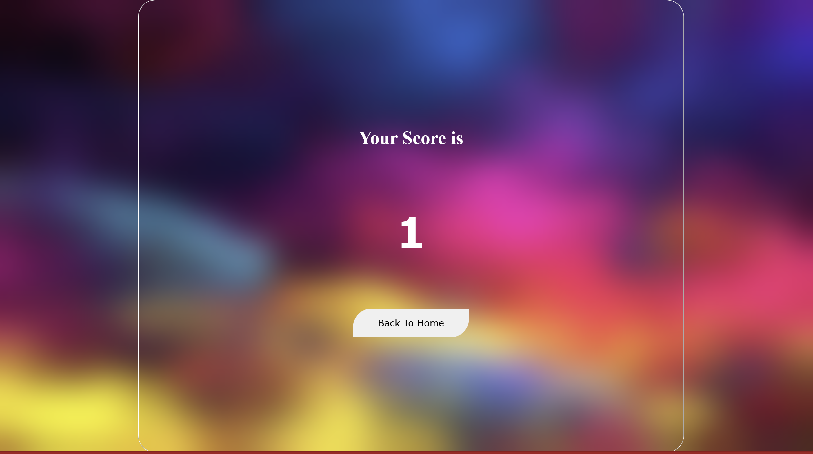

# 🚀 Full Stack Quiz Web Application

A dynamic full-stack Quiz Web Application built using:

- ⚛️ React.js (Vite) – Frontend
- ☕ Spring Boot – Backend
- 🗄️ MySQL – Database

This application allows a Quiz Provider (Admin) to create quizzes and generate a unique Quiz ID.  
Users can enter the Quiz ID to attempt the quiz and instantly view their final score.

---

## 📖 About The Project

This project demonstrates full-stack development by integrating:

- Modern React UI built with Vite
- RESTful Spring Boot backend
- MySQL relational database
- Dynamic quiz creation logic
- Random question selection based on category
- Real-time score calculation

The frontend communicates with the backend using REST APIs.

---

## 🏗️ System Architecture

User (React - Port 5173)
        ↓
REST API Calls (HTTP)
        ↓
Spring Boot Backend (Port 8080)
        ↓
MySQL Database (quizdb)

---

## 🎯 Key Features

### 👨‍💼 Admin / Quiz Provider
- Create quizzes
- Select quiz category (Java, Python, etc.)
- Define number of questions
- Automatic unique Quiz ID generation
- Store quiz configuration in database

### 👨‍🎓 User
- Enter provided Quiz ID
- Fetch quiz questions dynamically
- Random question selection from chosen category
- Submit answers
- Instant score calculation
- Redirect back to Home page after completion

---

## 🛠️ Tech Stack

### Frontend
- React.js (Vite)
- CSS
- Axios (API communication)

### Backend
- Spring Boot
- Spring Data JPA
- REST Controllers

### Database
- MySQL

---

## ⚙️ Important Port Information

Make sure the following ports are correctly configured:

| Service        | Port  |
|---------------|-------|
| React (Vite)  | 5173  |
| Spring Boot   | 8080  |
| MySQL         | 3306  |

If you change ports, update:

- API URLs in React
- `server.port` in Spring Boot
- CORS configuration if needed

---

## 🚀 Installation & Setup

### 🔹 1. Clone Repository

```bash
git clone https://github.com/your-username/your-repo-name.git
cd your-repo-name
```

---

## 🔹 2. Database Setup (MySQL)

Create a database:

```sql
CREATE DATABASE quizdb;
```

⚠️ Important:
Make sure your database name matches the one in `application.properties`.

---

## 🔹 3. Backend Setup (Spring Boot)

Go to backend folder:

```bash
cd backend
```

### Update `application.properties`:

```properties
server.port=8080

spring.datasource.url=jdbc:mysql://localhost:3306/quizdb
spring.datasource.username=your_username
spring.datasource.password=your_password

spring.jpa.hibernate.ddl-auto=update
spring.jpa.show-sql=true
```

Make sure:

- MySQL server is running
- Database name is correct
- Username & password are correct

Start backend:

```bash
mvn spring-boot:run
```

Backend runs on:

```
http://localhost:8080
```

---

## 🔹 4. Frontend Setup (React + Vite)

Go to frontend folder:

```bash
cd frontend
npm install
npm run dev
```

Frontend runs on:

```
http://localhost:5173
```

---

## 🔁 Important: API Base URL in React

Make sure your API calls point to:

```
http://localhost:8080
```

Example:

```javascript
fetch("http://localhost:8080/quiz/get/" + quizId)
```

If port changes, update this URL.

---

## 📸 Screenshots

### 🏠 Home Page


### 📝 Quiz Interface


### 🎯 Final Score Page


---

## 🔌 API Endpoints

| Method |                      Endpoint                                   |         Description                |
|--------|-----------------------------------------------------------------|------------------------------------|
| POST   | /quiz/create?category=""&numQ=numberofquestionsYouWant&title="" | Create a new quiz                  |
| GET    | /quiz/get/{quizId}                                              | Fetch quiz questions               |
| POST   | /quiz/submit/{quizId}                                           | Submit answers and calculate score |

---

## 📂 Project Structure

```
quiz-app/
│
├── frontend/        # React (Vite)
├── backend/         # Spring Boot
├── screenshots/
│     ├── Home.png
│     ├── Quiz.png
│     └── score.png
└── README.md
```

---

## ⚠️ Important Notes

- Ensure Spring Boot runs before starting React.
- Check CORS configuration in backend if API calls fail.
- Make sure ports 8080 and 5173 are not blocked.
- Verify MySQL database name matches configuration.
- If backend port changes, update API URLs in React.

---

## 💡 Future Enhancements

- Add timer functionality
- Implement JWT authentication
- Add role-based login (Admin/User)
- Add leaderboard system
- Dockerize application
- Deploy to cloud (AWS / Render / Vercel)

---

## 🧠 Learning Outcomes

This project demonstrates:

- Full-stack development
- REST API integration
- Database handling with JPA
- Backend business logic implementation
- Frontend state management
- Client-server architecture understanding
- Real-world quiz system design

---

## 👨‍💻 Kiran T B

Your Name  
GitHub: https://github.com/kirantb05  

---

⭐ If you found this project helpful, consider giving it a star!
